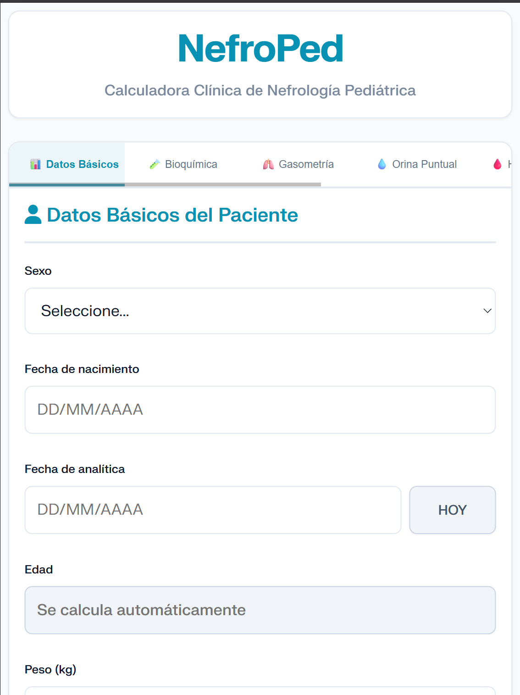
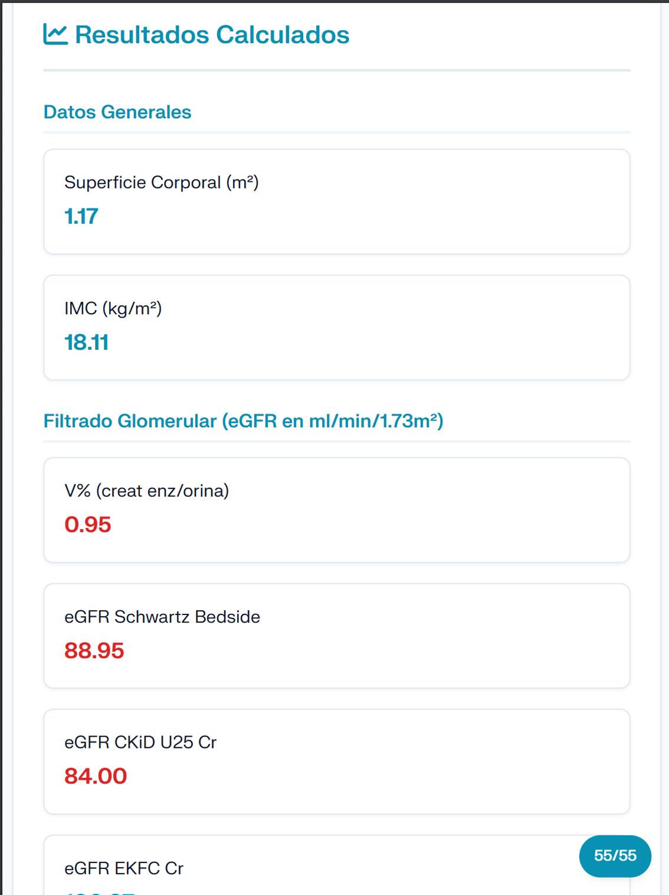

# 🩺 NefroPed 

**Calculadora Clínica Avanzada de Nefrología Pediátrica** 🌐 [Visitar la aplicación: nefroped.es](https://nefroped.es)

  
  &nbsp;&nbsp;&nbsp;&nbsp;
  
   
  <em>(Interfaz principal de la aplicación con soporte nativo)</em>

NefroPed es una Aplicación Web Progresiva (PWA) diseñada específicamente para profesionales sanitarios en el ámbito de la nefrología pediátrica. Permite realizar cálculos clínicos complejos, estadificaciones y fórmulas de forma rápida, segura y adaptada al entorno hospitalario.

## ✨ Características Principales

* **🏥 Orientada a la práctica clínica:** Fórmulas actualizadas y validadas en la literatura médica estándar:
  * **Filtrado Glomerular:** Schwartz (Neonato, Lactante, Bedside), CKiD U25 (Cr, CistC, Combinada), EKFC (Cr, CistC) y Bökenkamp.
  * **Estadificación Automática:** Según guías KDIGO 2024 (>2 años) y adaptación ERC para lactantes (<2 años).
  * **Ecografía Renal:** Percentiles de longitud renal (Obrycki) e hipertrofia compensadora en paciente monoreno (Krill).
  * **Otros Cálculos:** Excreciones fraccionales, ratios urinarios (Pr/Cr, Alb/Cr, Ca/Cr, Citrato/Cr, etc.), RTP, Superficie Corporal e IMC.
* **💾 Autoguardado Inteligente:** Los datos introducidos no se pierden si recargas la página o cambias de pestaña accidentalmente.
* **🔒 Privacidad por Diseño (100% Local):** Los datos clínicos no se envían a ningún servidor. Todo el procesamiento matemático se realiza localmente en el navegador del dispositivo del usuario, garantizando el cumplimiento normativo de protección de datos (RGPD).
* **📱 Aplicación Web Progresiva (PWA):** Instalable en dispositivos móviles (iOS/Android) y ordenadores sin pasar por tiendas de aplicaciones. Funciona offline una vez cargada.
* **📋 Integración en Historia Clínica:** Generación automática de informes médicos agrupados por sistemas (Hidrosalino, Fosfocálcico, Hematológico, etc.). Incluye detección de valores fuera de rango y exportación a PDF, Word (.docx), impresión y copiado al portapapeles.
* **🎨 Interfaz UI/UX Moderna:** Diseño aséptico, simétrico, con soporte para Modo Claro/Oscuro y adaptabilidad total.

## 🛠️ Stack Tecnológico

* **Frontend:** HTML5, CSS3 (Variables nativas, CSS Grid, Flexbox), JavaScript (Vanilla ES6+).
* **Librerías externas:** SweetAlert2 (UI), FontAwesome (Iconos), jsPDF (Exportación a PDF), FileSaver.js y DOMPurify (Seguridad).
* **Arquitectura:** Static Web App / PWA (Service Workers, Manifest).

## 🚀 Instalación y Despliegue Local

Al ser una aplicación 100% estática (Client-side), no requiere de bases de datos ni servidores complejos:

1. Clona o descarga este repositorio.
2. Abre la carpeta del proyecto.
3. Lanza un servidor local (por ejemplo, con la extensión *Live Server* de VSCode o con Python: `python -m http.server 8000`).
4. Abre `http://localhost:8000` en tu navegador.
*(Nota: El Service Worker para la funcionalidad offline requiere ejecutarse bajo HTTPS o en localhost).*

## 👨‍⚕️ Autores y Dirección

* **Dirección Médica e Idea Original:** Dra. Ana María Ortega Morales (FEA Pediatría en HUSC Granada).
* **Desarrollo Técnico e Informático:** Felipe Reyes.

## ⚠️ Aviso Legal

*NefroPed es una herramienta informática de apoyo diseñada exclusivamente para profesionales sanitarios. Esta aplicación no constituye un dispositivo médico ni un sistema de diagnóstico, y los resultados generados nunca deben sustituir el juicio clínico del facultativo. Todos los derechos reservados.*

## 📬 Contacto y Soporte

Para consultas técnicas, sugerencias de mejora o contacto institucional, puedes escribir a:
**📧 contacto@nefroped.es**
